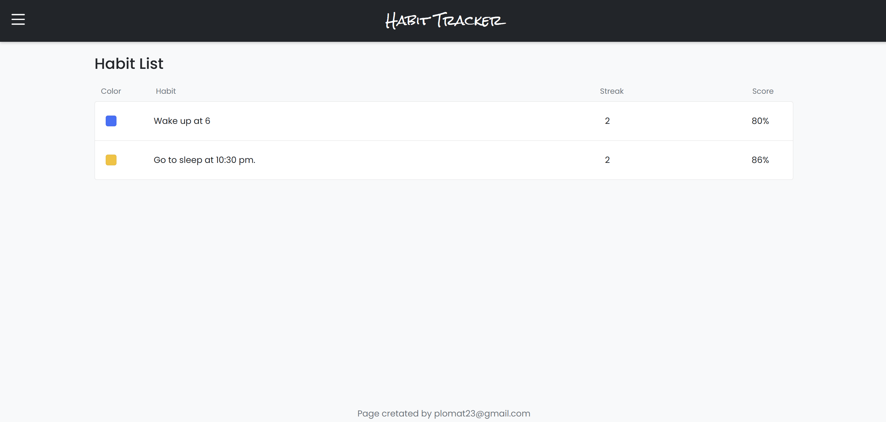
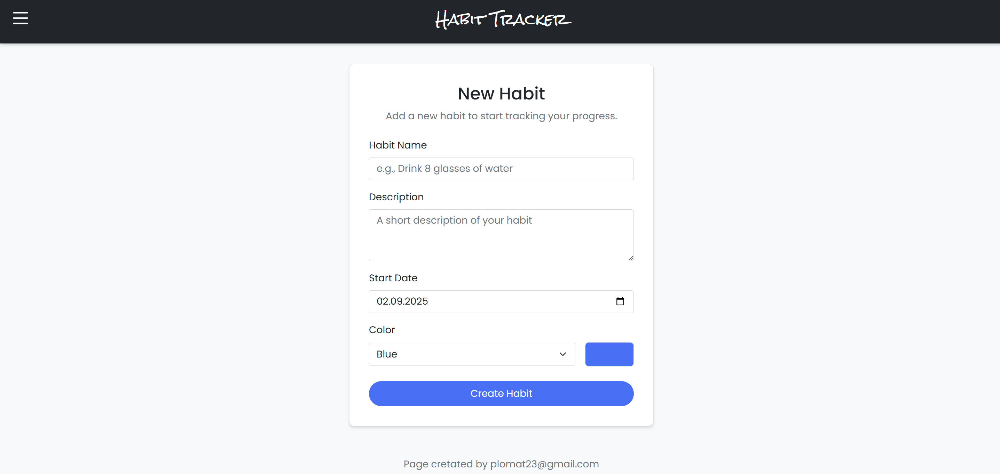
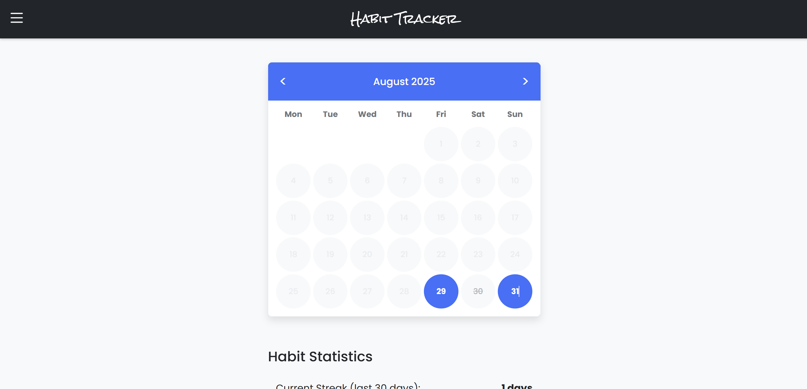
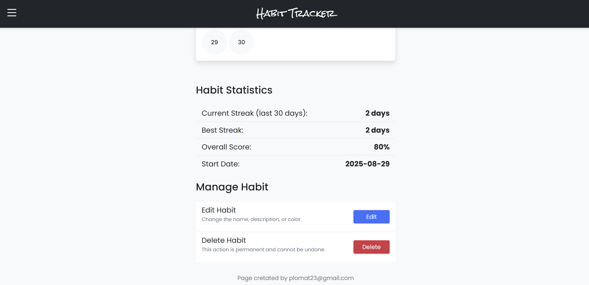

# 🌱 Habit Application

A web application built with Django that helps users easily track, build, and maintain positive habits, keeping motivation high and streaks alive.

## Screenshots

Below are a few snapshots of the application interface.

### 1. Dashboard
*Main view after logging in, showing habit progress.*



### 2. Habit Creation
*Form to add a new habit with frequency, duration, and color.*



### 3. Habit Progress
*Visualization of completed and missed days.*



### 4. Habit Statistics
*Habit statistics (current streak, best streak, overall score, start date).*



---

## Application Demo

To see the application in action, please watch the short video demonstration:

**[Click here to watch the video demo](https://www.loom.com/share/a633947fb7274cf49dfc902c0e30eb0c?sid=f2ccf813-d953-4b37-8974-0bbd205aceb4)**

---

## Key Features

* **User Accounts:** Secure authentication system.
* **Habit Management:** Create, edit, and delete habits with customizable settings.
* **Progress Tracking:** Calculate success rates and streaks automatically.
* **Custom Colors:** Personalize habits with unique colors.
* **Daily Check-ins:** Mark habits as complete or incomplete each day.
* **Responsive Design:** Works smoothly on desktop and mobile.

---

## Tech Stack

* **Backend:** Django, Django REST Framework
* **Frontend:** Django Templates / HTMX (or React if chosen)
* **Database:** PostgreSQL / MySQL / SQLite
* **Authentication:** Django Auth
* **Styling:** Bootstrap 5, CSS3

---

## Installation and Setup

Follow these steps to set up and run the project locally.

### 1. Prerequisites

* **Python 3.10+**
* A virtual environment tool (venv or pipenv)
* **PostgreSQL/MySQL** (optional – SQLite works by default)

### 2. Clone the Repository

```bash
git clone https://github.com/pucio8/habit_application.git
cd habit_application
```
### 3. Create and Activate a Virtual Environment
Windows:
```bash
python -m venv .venv
.\.venv\Scripts\activate
```
macOS / Linux:
```bash
python3 -m venv .venv
source .venv/bin/activate
```

### 4. Install Dependencies
```bash
pip install -r requirements.txt
```
### 5. Configure Environment Variables
Create a .env file in the project root and add:
```bash
# --- DATABASE SETTINGS (MySQL) ---
DB_NAME=
DB_USER=
DB_PASSWORD=
DB_HOST=
DB_PORT=
# --- DJANGO CORE SETTINGS ---
SECRET_KEY=

# Development (debug) mode. For local development, set to True.
DEBUG=

# Allowed hosts/domains for the application.
# For local development, these values are standard.
ALLOWED_HOSTS=

# Email settings
# --------------------------------------------------------------------------
EMAIL_HOST=
EMAIL_PORT=
EMAIL_USE_TLS=
EMAIL_HOST_USER=
EMAIL_HOST_PASSWORD=

# CACHE SETTINGS 
# --------------------------------------------------------------------------
USE_REDIS_CACHE=
```

### 6. Run Migrations

```bash
python manage.py migrate
```

### 7. Start the Server

```bash
python manage.py runserver
```

The application will be available in your browser at http://127.0.0.1:8000.

---

## 🚀 How to Use

You can run the application locally (see **Installation and Setup**) or deploy it online using **Render**.

### Deploy on Render

1. Push your code to GitHub, making sure it includes:
   * `requirements.txt`
   * `Procfile` (for Gunicorn)
   * `.env` variables (add them later in Render dashboard)

2. Go to [Render Dashboard](https://dashboard.render.com/) → **New Web Service**.

3. Connect your GitHub repository.

4. In the **Build Command**, set:
   ```bash
   pip install -r requirements.txt && python manage.py migrate
   ```
5. In the Start Command, set:
    ```bash
    gunicorn habit_application.wsgi:application
    ```

Add your environment variables (e.g. SECRET_KEY, DEBUG, DB_NAME, etc.) in the Render dashboard.

Render will assign you a public URL (e.g. https://your-app.onrender.com).

👉 Now your Habit Application is live and accessible from anywhere!

---

## 🤝 Contributing

Contributions are welcome!  

If you’d like to improve this project, please follow these steps:

1. Fork the repository.
2. Create a new branch for your feature or bugfix:

```bash
git checkout -b feature/your-feature-name
```

Commit your changes:

```bash
git commit -m "Add: your descriptive commit message"

Push to your branch:
git push origin feature/your-feature-name
Open a Pull Request on GitHub.
```

Please make sure your code follows best practices and is well-documented. 🚀

---